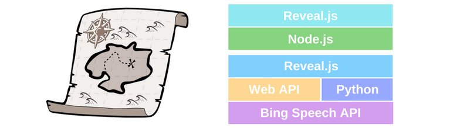

The main idea and motivation behind StageMate is to assist you while pitching your idea. It will cover all aspects of your pitch from skipping slides to reminding you if you miss some major point.<br>
Furthermore, **it will keep an eye on you, so that you stay in time**.

**Our Inspiration**<br>
We live in a time where you can have reasonable conversations with your computer, but you still need to ask a friend to sit in the audience, to give you feedback on your presentation. Why can’t your computer do this by itself?

**StageMate will solve this issue and be the smart assistant for your pitch.**

## Table of Contents

  * [What can your StageMate do?](#what-can-your-stagemate-do)
  * [How we build it](#how-we-build-it)
  * [Setup](#setup)
    - [Setup the presentation with node.js]
    - [Setup audio transcription with python]
    - [Connect the audio transcription to node.js]
  * [How to use StageMate](#how-to-use-stageMate)
    - [Change target presentation]
    - [Change transcription configuration]
  * [What we learned](#what-we-learned)
  * [Common issues](#common-issues)
  * [Authors](#authors)

## What can your StageMate do?
<br>
StageMate listens to your speech and tries to match your speech to your notes and slides.<br>
Therefore, it can **proceed to the next slide**, **track your time** and **tell you whether you missed the point or not**.

If you do not believe us, check out this YouTube video of one of our first tests. We played some Buzzword Bingo with StageMate without manual interventions. **It's fully autonomous!**  

[](https://youtu.be/ndpWiEG0GqM)<br>

Leave a star if you like the idea :)

## How we build it


StageMate consists out of 3 modules. The First is **audio processing and transcription module**, that uses a sliding window approach in order to accomplish real time transcription with the speech to text APIs by Microsoft Azure. <br>
The second module contains the logic for **matching transcribed text to speaker notes** and emits events to the **presenter view**, the third module. It is a custom implementation of the presenter view for the presentation tool reveal.js.

## Setup
In order to setup StageMate you will need to setup the node.js server and start the python script that transcribes your audio.

### Setup the presentation with node.js
Navigate into the `node-js` directory and install all node dependencies.
```
cd node-js
npm install
```
Start the StageMate Node.js server and checkout our default presentation with the special presenter view.
```
npm start
```
The **presentation** can be found here [localhost:3000/presentation](http://localhost:3000/presentation) and the **presenter view** here [localhost:3000/](http://localhost:3000/).

You can navigate through the slides and uses the backup method of clicking on points check them in the presenter view.

### Setup audio transcription with python
First of all you need to make sure, that you installed python ([download here](https://www.python.org/downloads/)) and pip ([How to install pip](https://pip.pypa.io/en/stable/installing/)). <br>
Afterwards we install all the needed dependencies of the python script with pip.
```
pip install requests
pip install pyaudio
pip install SpeechRecognition
```

Now your need to add some Bing Speech API keys to the Key Array ([audioTranscription.py](./AudioTranscription/audioTransciption.py) `line 20`). The needed amount varies according to the selected `DELTA` value, in order to get no `to many request` response. A Recommendation might be around `4/DELTA`.<br>
You can get two keys with your GitHub account to try the [Bing Speech API](https://azure.microsoft.com/en-us/try/cognitive-services/) service.

After the installation you can try the script by simply starting it from the command line.
```
python ./AudioTranscription/audioTransciption.py
```
You can see the results of the transcription of each sliding window in the command line.

If you want to tune the amount of sliding windows and their length, check out the comments in the [audioTranscription.py](./AudioTranscription/audioTransciption.py) script.
Furthermore, you can change the microphone by its `AUDIO_DEVICE_INDEX` ([audioTranscription.py](./AudioTranscription/audioTransciption.py) `line 38`) according to the PyAudio definition.

### Connect the audio transcription to node.js
In order to **enable the python script to send the transcription to the node.js server**, we need to expose the [localhost:3000/speech](http://localhost:3000/speech) API to the python script.

If you are using the **same computer** for the node.js server and the python script you do not need to change anything. <br>
If you run them on **different computers**, you will need to change the `IP` of the server in the python script according to their new value ([audioTranscription.py](./AudioTranscription/audioTransciption.py) `line 44`).

Congratulation 🎉 you **completed the setup process** of StageMate and can try it with our demo slides.
When you mention the keywords as described by the bullet points on the **presenter view** it will proceed in the presentation.
We loved to play Buzzword Bingo, even though there was some latency in the system.

## How to use StageMate
Let's start with the interesting section. I imaging, after setting up the system and trying our demo, you want to **use your own slides and bullet points**.<br>
There are two configurations, you will need to make. **Design your Reaveal.js slides** and **configure the keywords and their actions** in the presentation.

### Change target presentation
Since StageMate is build on top of Reveal.js you can use any Reaveal.js presentation.
You only need to replace the `node-js/presentation.html` file with your Reaveal.js presentation.

Reaveal.js presentations are written using HTML or Markdown but there's also an online editor for those of you who prefer a graphical interface (e.g. [slides.com](https://slides.com)).

### Change transcription configuration
The transcription configuration contains the **information about each point on the slides and their following actions**. <br>
The JSON file `node-js/processing/sample_data.json` contains this configuration and can be adjusted to your needs.

The structure of the file can be created according the following template and should be straight forward to adapt.
```json
[{
        "slide": 0,
        "notes": [{
            "type": "buzzword",
            "order": 0,
            "text": "This is the description of the first point",
            "data": [
                "first keyword",
                "second keyword",
                "third keyword"
            ],
            "postactions": [
                "triggerAnimation"
            ]
            },{
                "type": "buzzword",
                "order": 1,
                "text": "This is the description of the second point",
                "data": [
                    "keyword"
                ],
                "postactions": [
                    "hideBlock"
                ]
            },
            {
                "type": "buzzword",
                "order": 2,
                "text": "This is the description of the third point",
                "data": [
                    "keyword"
                ],
                "postactions": [
                    "nextSlide"
                ]
        }]
    },
    {
        ...
}]
```

Now you know everything that is needed to use StageMate with your own presentations.
Enjoy our small tool, we coded during the 24h InnoHack 2017 Hackathon.

## What we learned
**StageMate is a Hackathon project** and was build in **< 24h** since we managed to get some sleep (I know this is not the real Hackathon experience 😨). <br>
Besides the knowledge progress in the used technologies, we have learned to work in a team and to face and overcame the challenges.

## Common issues
Here are some of the **common issues** we encountered while setting up StageMate.
If you find an issue, we hope this might be helpful for you. Otherwise, please create a new issue.

### Bing API - to many request
The Bing speech API has a **limit for API requests**, therefore it might be helpful to generate more than one Bing API key to get a better performance out of the system.

## Authors

- **Frederic Tausch** @[Langhalsdino](https://github.com/Langhalsdino)
- **Timo Schneider** @[tschneid](https://github.com/tschneid)
- **Enrico Kaack** @[enrico-kaack](https://github.com/enrico-kaack)
- **Jonas Fuchs** @[Jonasfuchs](https://github.com/Jonasfuchs)
